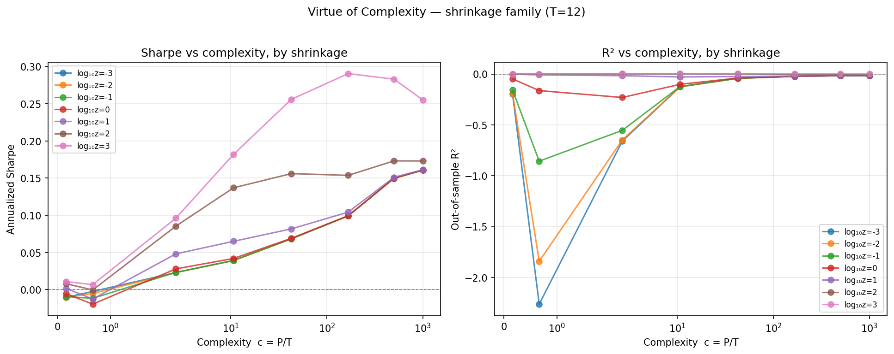

# The Virtue of Complexity in Return Prediction — Replication & Critique

Do heavily overparameterized models genuinely predict market returns, or is the
apparent signal repackaged volatility-timed momentum? This repo replicates the
"virtue of complexity" result of **Kelly, Malamud & Zhou (2024)**, builds on the
**Gu–Kelly–Xiu (2020)** machine-learning-in-asset-pricing foundation, and stress-tests
the KMZ result against the three published critiques — **Nagel (2025)**, **Buncic (2025)**,
and **Cartea, Jin & Shi (2025)** — to document which findings survive under which
specifications.

**Status** (July 2026): KMZ replication reproduces the core result · GKX foundation
in progress · critiques + research note planned.

---

## Result — Virtue of Complexity (KMZ 2024)

Replicating KMZ's market-timing exercise on the 15 Goyal–Welch predictors (1926–2025),
random Fourier features + ridge regression reproduce the paper's central paradox: **as
model complexity c = P/T grows, the timing strategy's Sharpe ratio rises even though
out-of-sample R² stays negative.** The shrinkage family shows regularization taming the
double-descent dip at the interpolation boundary (c ≈ 1).

*Sharpe ratio and out-of-sample R² vs. complexity, one line per shrinkage level (T=12).
Heavier shrinkage both lifts the Sharpe and smooths the R² dip. Qualitative match to KMZ
Figures 7–8; Sharpe levels tighten with more random-feature draws and the exact
value-weighted target series.*

---

## Repository

| Path | Contents |
|---|---|
| `kmz/` | **KMZ (2024) replication** — random Fourier features of the 15 Goyal–Welch predictors, ridge/ridgeless regression across the complexity spectrum, OOS R² and Sharpe-vs-complexity curves. *(complete)* |
| `gkx/` | Scaled replication of **Gu–Kelly–Xiu (2020)** on the authors' published characteristics panel. *(in progress)* |
| `debate/` | Each critique re-run as a counter-specification against the KMZ pipeline. *(planned)* |
| `note/` | The research note adjudicating the debate. *(planned)* |
| `SPEC.md` | Frozen implementation specifications drawn directly from the papers. |

---

## Data

Datasets are not committed (large, and third-party data can't be redistributed).
To reproduce:

- **Goyal–Welch predictors** — Amit Goyal's website (2024 update).
- **GKX characteristics panel** — Dacheng Xiu's website.

See `SPEC.md` for exact sources, column mappings, and construction.