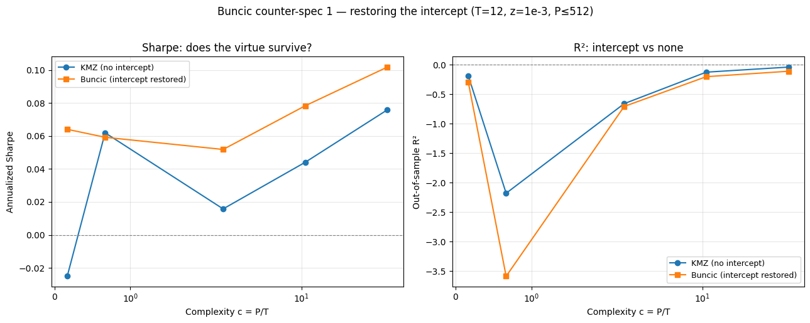
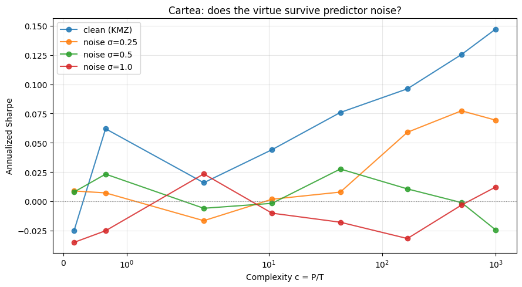

# The Virtue of Complexity in Return Prediction — Replication & Critique

Do heavily overparameterized models genuinely predict market returns, or is the
apparent signal repackaged volatility-timed momentum? This repo replicates the
"virtue of complexity" result of **Kelly, Malamud & Zhou (2024)**, builds on the
**Gu–Kelly–Xiu (2020)** machine-learning-in-asset-pricing foundation, and stress-tests
the KMZ result against the three published critiques — **Nagel (2025)**, **Buncic (2025)**,
and **Cartea, Jin & Shi (2025)** — to document which findings survive under which
specifications.

**Status** (September 2026): KMZ replication complete · all three critiques re-run as
counter-specifications · GKX foundation in progress.

---

## Result — Virtue of Complexity (KMZ 2024)

Replicating KMZ's market-timing exercise on the 15 Goyal–Welch predictors (monthly,
1930–2025 after warm-up), random Fourier features + ridge regression reproduce the paper's
central paradox: **as model complexity c = P/T grows, the timing strategy's Sharpe ratio
rises even though out-of-sample R² stays negative.** With T = 12 and light shrinkage, Sharpe
climbs from 0.02 at c ≈ 3 to 0.15 at c = 1000 while R² stays below zero throughout.

At the paper's headline setting (c = 1000, z = 10³) the Sharpe is 0.24 vs KMZ's 0.47; the best
setting in our grid reaches 0.28. The level gap reflects documented design differences: raw
rather than volatility-standardized returns (KMZ report their conclusions are unaffected by this
choice), the S&P 500 in place of the CRSP value-weighted index, 20 rather than 1,000
random-feature draws, and a more conservative timing for the lagged market return (month
t−1 rather than t). See `SPEC.md` for all deviations.

*Sharpe ratio and out-of-sample R² vs. complexity, one line per shrinkage level (T=12,
20 random-feature draws). Heavier shrinkage lifts the Sharpe and smooths the double-descent
dip in R² near the interpolation boundary (c ≈ 1). Qualitative match to KMZ Figures 7–8.*

---

## Critiques — which findings survive?

Each critique is re-run as a counter-specification on the same engine, data, and random
draws; every notebook's baseline reproduces the KMZ curve exactly.

| Critique | Counter-specification | Finding |
|---|---|---|
| **Buncic (2025)** | Restore an unpenalized intercept (P ≤ 512, c ≤ 43) | The intercept lifts the simplest model (P = 2) from −0.03 to 0.06, ~85% of the no-intercept model at c ≈ 43, so much of the low-complexity handicap is the missing intercept. The intercept model still improves with complexity (0.05 → 0.10 from c ≈ 3 to 43). Single-draw Sharpe varies widely (10–90%: −0.05 to 0.17 at low c). |
| **Nagel (2025)** | Vol-timed momentum, no predictors or random features | Momentum alone earns a Sharpe of 0.28, nearly double KMZ at c = 1000 (0.15). KMZ returns load significantly but weakly on momentum (corr 0.21, R² 4%); controlling for it cuts KMZ's Sharpe by ~40%, and the remainder is not significant. |
| **Cartea, Jin & Shi (2025)** | Gaussian noise added to the predictors | Mild noise (σ = 0.25) roughly halves the high-complexity Sharpe; σ ≥ 0.5 eliminates the complexity benefit. |

Caveats: KMZ's own Sharpe at c = 1000 (0.15 over ~95 years, t ≈ 1.4) is not individually
significant in this replication, which limits how sharply any critique can be adjudicated.
Sharpe ratios are not adjusted for static market exposure (KMZ additionally report alpha vs the
market); this matters most for the intercept result, since an intercept adds a long-market tilt.

---

## Repository

| Path | Contents |
|---|---|
| `kmz/` | **KMZ (2024) replication** — data build (`kmz_data.ipynb`) and pipeline (`kmz_pipeline.ipynb`): random Fourier features of the 15 Goyal–Welch predictors, dual-form ridge across the complexity spectrum, OOS R² and Sharpe-vs-complexity curves. *(complete)* |
| `debate/` | Each critique re-run as a counter-specification: `Buncic/`, `Nagel/`, `Cartea/`. *(complete)* |
| `SPEC.md` | Implementation specifications drawn from the papers, deviations, and full result tables. |

The scaled **Gu–Kelly–Xiu (2020)** replication and the research note are in progress and not
yet in this repo.

Notebooks run on Google Colab and read data from Google Drive; each critique notebook
carries its own copy of the KMZ engine (kept identical, with a built-in check that fails if a
copy drifts).

---

## Data

Datasets are not committed (large, and third-party data can't be redistributed).
To reproduce:

- **Goyal–Welch predictors** — Amit Goyal's website (2025 update, monthly).
- **GKX characteristics panel** — Dacheng Xiu's website.

See `SPEC.md` for exact sources, column mappings, and construction.
